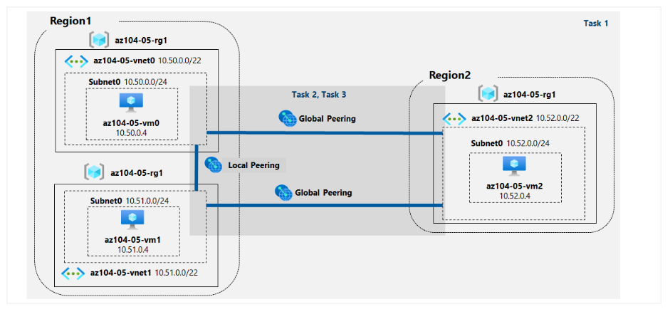
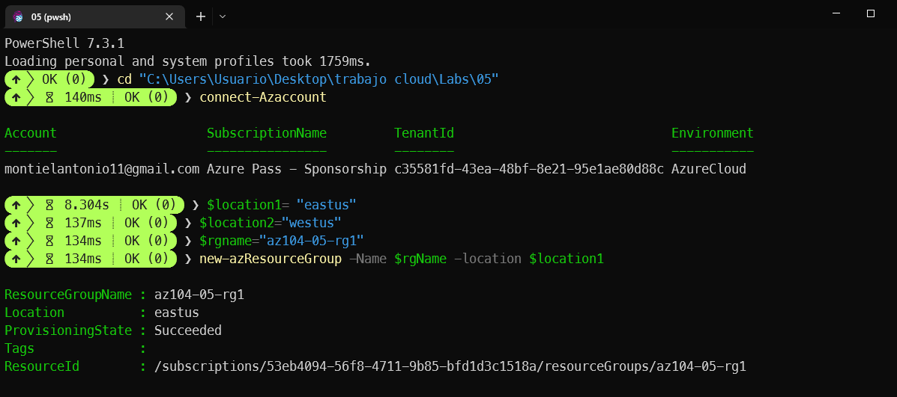
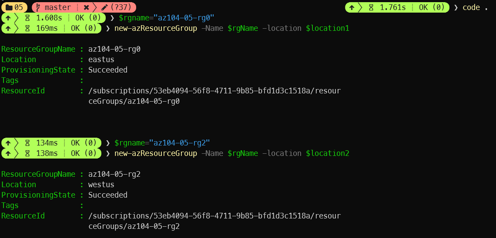
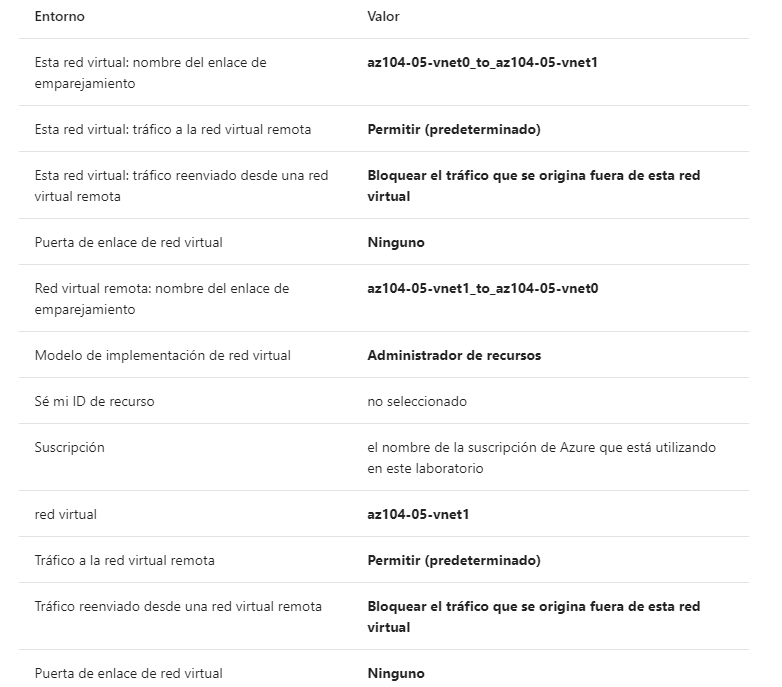
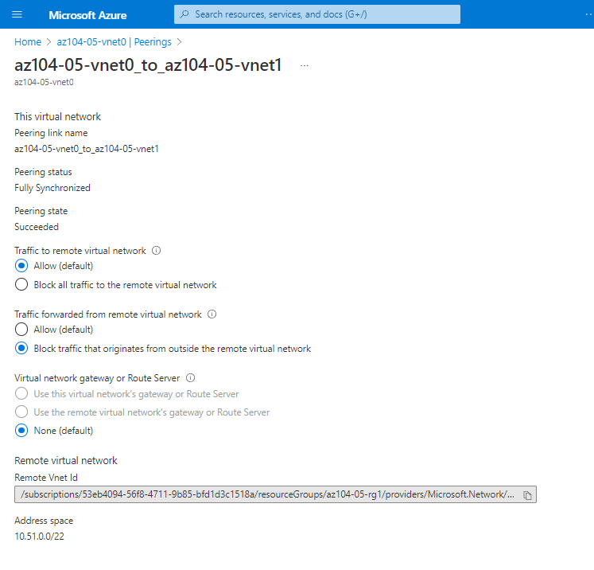
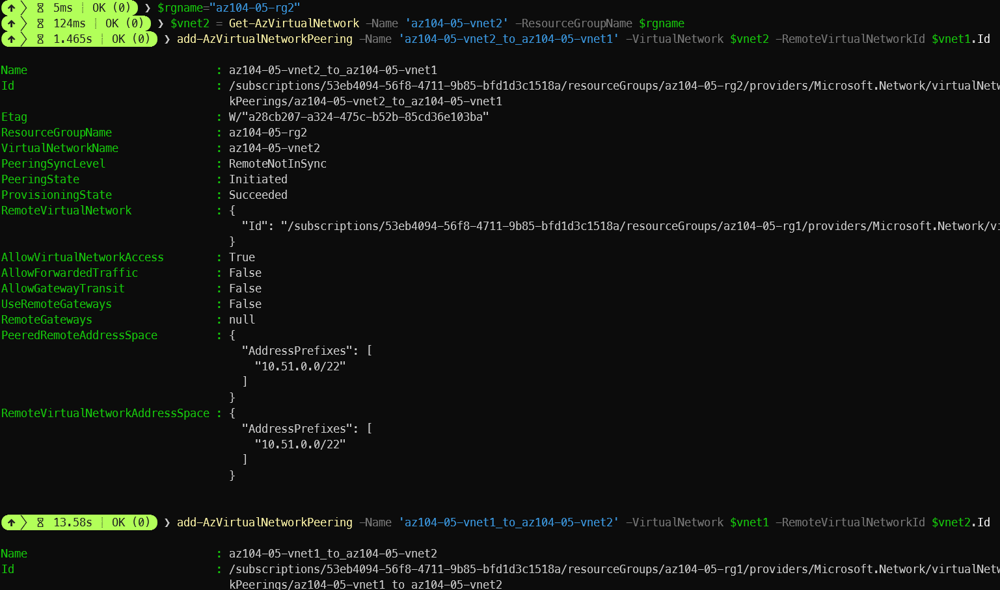
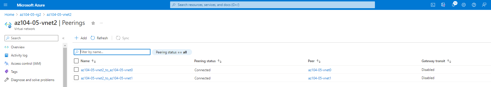
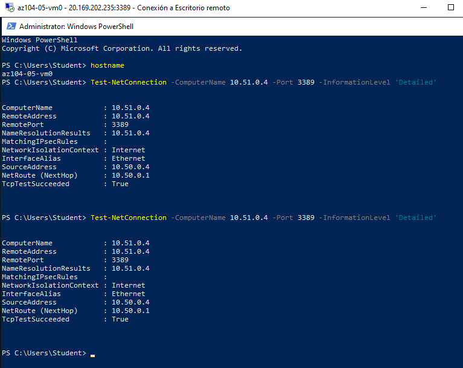
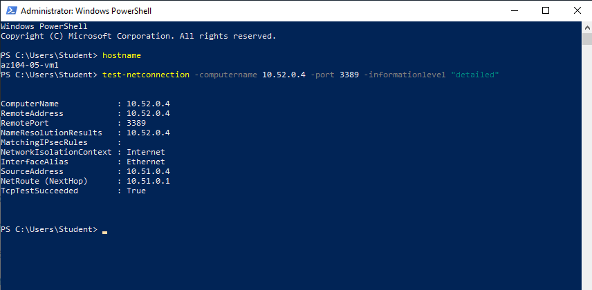

# Implementar la conectividad entre sitios

Manual sobre como Implementar conectividad entre sitios a través de Azure y PowerShell 

## Diagrama:

## **Paso 1: Aprovisionar el entorno de trabajo**

En esta tarea, implementará tres máquinas virtuales, cada una en una red virtual independiente, dos de ellas en la misma región de Azure y la tercera en otra región de Azure.

1. Inicie sesión en el [portal de Azure](https://portal.azure.com/) .

2. A continuación abrimos nuestro terminal (PowerShell) en Windows. En caso de que no lo tengas instalado, se puede hacer dentro de la plataforma de AZURE a través de CloudShell.

3. Iniciamos conexión con el comando connect-azaccount

4. Ahora copiamos la ruta de los archivos JSON ,  **Allfiles\Labs\05\az104-05-vnetvm-loop-template.json** y **\ Allfiles\Labs\05\az104-05-vnetvm-loop-parameters.json** y escribimos el comando quedando algo parecido a esto: *cd "C:\Users\Usuario\Desktop\trabajo cloud\Labs\05"*

5. Establecemos los valores para crear así el primer grupo de recursos:

   Las dos primeras redes virtuales y un par de máquinas virtuales se implementarán en [Azure_region_1]. La tercera red virtual y la tercera máquina virtual se implementarán en el mismo grupo de recursos pero en otro [Azure_region_2]

   

6. Y así con los demás:

   

Para identificar las regiones de Azure, desde una sesión de PowerShell en Cloud Shell, ejecute **(Get-AzLocation).Location**

6. Ejecutamos lo siguiente para crear las tres redes virtuales e implementar máquinas virtuales en ellas usando la plantilla y los archivos de parámetros que cargamos anteriormente:

   New-AzResourceGroupDeployment `

    `-ResourceGroupName $rgName `

    `-TemplateFile $HOME/az104-05-vnetvm-loop-template.json `

    `-TemplateParameterFile $HOME/az104-05-vnetvm-loop-parameters.json  `

   `-location1 $location1` 

   -location2 $location2

   

   ## Paso 2: Configurar el emparejamiento (peering) de las LAN y WAN

   1. En Azure Portal, busque y seleccione **Redes virtuales** .

   2. Revise las redes virtuales que creó en la tarea anterior y verifique que las dos primeras estén ubicadas en la misma región de Azure y la tercera en una región de Azure diferente.

   3. En la lista de redes virtuales, haga clic en **az104-05-vnet0** .

   4. En la hoja de red virtual **az104-05-vnet0** , en la sección **Configuración , haga clic en** **Emparejamientos** (peering) y luego haga clic en **+ Agregar** .

   5. Agregue un emparejamiento con la siguiente configuración (deje los demás con sus valores predeterminados) y haga clic en **Agregar** :

      

Al crearlo y pinchando en el *peering*, deberá quedar algo tal que así:

6. En esta ocasión hemos visto como hacerlo a través de la interfaz gráfica de Azure. Ahora lo haremos a través de comando por PowerShell. Haremos ahora el emparejamiento de la **az104-05-vnet0**:

   ​	$rgName = 'az104-05-rg0`

   ​	$vnet0 = Get-AzVirtualNetwork -Name 'az104-05-vnet0' -ResourceGroupName $rgname

   ​	$vnet2 = Get-AzVirtualNetwork -Name 'az104-05-vnet2' -ResourceGroupName $rgname

   ​	Add-AzVirtualNetworkPeering -Name 'az104-05-vnet0_to_az104-05-vnet2' -VirtualNetwork 	$vnet0 -RemoteVirtualNetworkId $vnet2.Id

   ​	Add-AzVirtualNetworkPeering -Name 'az104-05-vnet2_to_az104-05-vnet0' -VirtualNetwork 	$vnet2 -RemoteVirtualNetworkId $vnet0.Id

   

   7. Luego haremos lo mismo para la red **az104-05-vnet1**:

   $rgName = 'az104-05-rg1' 

   $vnet1 = Get-AzVirtualNetwork -Name 'az104-05-vnet1' -ResourceGroupName $rgname 

   $vnet2 = Get-AzVirtualNetwork -Name 'az104-05-vnet2' -ResourceGroupName $rgname 

   Add-AzVirtualNetworkPeering -Name 'az104-05-vnet1_to_az104-05-vnet2' -VirtualNetwork $vnet1 -RemoteVirtualNetworkId $vnet2.Id 

   Add-AzVirtualNetworkPeering -Name 'az104-05-vnet2_to_az104-05-vnet1' -VirtualNetwork $vnet2 -RemoteVirtualNetworkId $vnet1.Id

   

   8. Luego lo mismo para la **az104-05-rg2** quedando algo tal que así:

      

   De esta manera ya queda configurado cada uno de los emparejamientos de cada red.

   ## Paso 3: Probar la conectividad en los sitios

   Después de realizar cada uno de los pasos anteriores, comprobaremos en el portal de Azure que los *peering* están correctamente establecidos. 

   

   Luego de comprobarlo seguiremos los siguientes pasos para comprobar que cada máquina virtual qeu hemos creado en los distintos grupos de recurso pueden comunicarse entre sí:

   1. En Azure Portal, busque y seleccione **Máquinas virtuales** .

   2. En la lista de máquinas virtuales, haga clic en **az104-05-vm0** .

   3. En la hoja **az104-05-vm0** , haga clic en **Conectar** , en el menú desplegable, haga clic en **RDP** , en la hoja **Conectar con RDP , haga clic en** **Descargar archivo RDP** y siga las indicaciones para iniciar la sesión de Escritorio remoto.

   4. Cuando se le solicite, inicie sesión con el nombre de usuario del **estudiante** y la contraseña de su archivo de parámetros.

   5. Dentro de la sesión de Escritorio remoto a **az104-05-vm0** , haga clic con el botón derecho en el botón **Inicio** y, en el menú contextual, haga clic en **Windows PowerShell (Administrador)** .

   6. En la ventana de la consola de Windows PowerShell, ejecute lo siguiente para probar la conectividad con **az104-05-vm1** (que tiene la dirección IP privada de **10.51.0.4** ) a través del puerto TCP 3389:

      

7. Repetiremos los pasos con la máquina **az104-05-vm1** y **az104-05-vm1**:

   

Podemos comprobar así, que están interconectadas entre sí. Ya tenemos el esquema completo.
